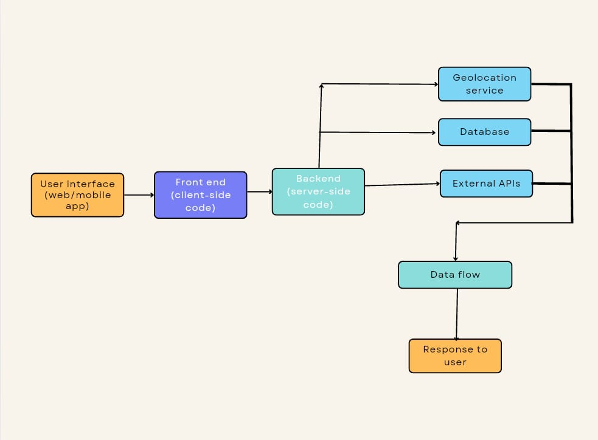

# Smart India Hackathon Workshop

# Date: 13.05.2024
## Register Number: 212223110037
## Name: Rajalakshmi R

## Problem Title
E-Waste Facility Locator
## Problem Description
Website that tells you the location of the nearest e-waste collection and recycling facility. Offers educational pop-ups on the harmful components of your e-waste and their effects on the environment and human health if not disposed correctly. There could be an option to input the model of your old device and earn credit points relative to the amount of precious metals recovered from the device if disposed correctly.
## Problem Creater's Organization
Ministry of Environment

## Idea
To provide users with a convenient way to locate nearby e-waste recycling facilities where they can responsibly dispose of their electronic devices.

## Proposed Solution / Architecture Diagram



## Use Cases
Individual Users:

Locating Nearby Facilities: Individuals can use the locator to find e-waste recycling facilities near their location, making it convenient for them to responsibly dispose of their old electronic devices.
Checking Accepted Items: Users can check which types of electronic items are accepted at each facility, ensuring they are disposing of their waste appropriately.
Getting Directions: Users can get directions to the selected facility, making it easier for them to drop off their e-waste.
Businesses and Organizations:

Managing Corporate E-Waste: Businesses and organizations can use the locator to find certified e-waste recycling facilities for proper disposal of their old electronic equipment in compliance with environmental regulations.
Scheduling Pickups: Some facilities may offer pickup services for large quantities of e-waste. Businesses can use the locator to find facilities that provide such services and schedule pickups as needed.
Local Governments and Municipalities:

Promoting Responsible Recycling: Local governments can promote the use of the locator among residents to encourage responsible recycling practices and reduce e-waste pollution in their communities.
Planning Recycling Events: Municipalities can use the locator to identify areas with a high demand for e-waste recycling facilities and organize recycling events or drop-off locations in those areas.
E-Waste Recycling Facilities:

Increasing Visibility: Recycling facilities can list their services on the locator to increase their visibility and attract more customers looking to dispose of their e-waste responsibly.
Managing Inventory: Facilities can use the locator to track the types and quantities of e-waste they receive, helping them manage their inventory and recycling processes more efficiently.
Environmental Organizations:

Educating the Public: Environmental organizations can use the locator as part of their educational outreach efforts to raise awareness about the importance of e-waste recycling and provide resources for individuals looking to take action.
Researchers and Policymakers:

Data Analysis: Researchers and policymakers can use data collected from the locator to analyze trends in e-waste disposal and recycling, identify areas with high e-waste generation, and develop policies and initiatives to address e-waste management challenges.

## Technology Stack
```
1)User Interface (Web/Mobile App): The starting point where users interact with the system.

2)Frontend (Client-side code): Handles user inputs, sends requests to the backend, and updates the UI based on responses.

3)Backend (Server-side code): Processes requests from the frontend, interacts with the database, external APIs, and other services.

4)Geolocation Service: Determines the user's current location if needed.

5)Database: Stores information about e-waste facilities.

6)External APIs: Such as mapping services for displaying facility locations and directions.

7)Data Flow: Represents the flow of data between various components, including user input, backend processing, database queries, and external services.

8)Response to User: The final output displayed to the user, including search results and facility information.
```

## Dependencies
A reliable web hosting service. (3 days to create) A third-party service or internal database for estimating precious metal content in various devices. ( a week to get permissions and a month for estimating the metal amount) Payment processing gateway (optional) if points are redeemable for rewards.(money fundings from government).